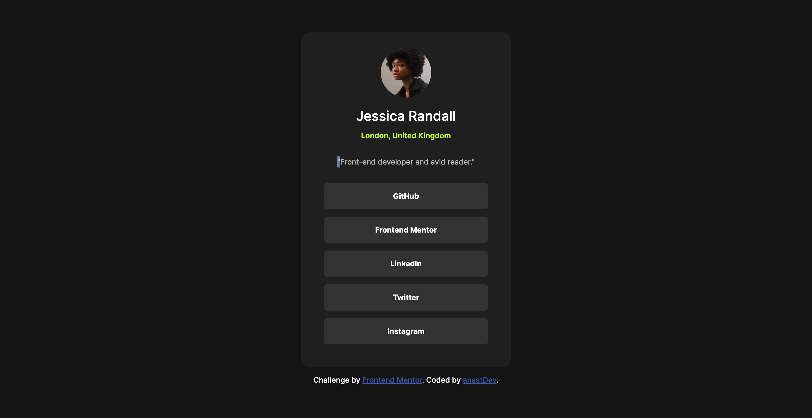

# Frontend Mentor - Social links profile solution

## Table of contents

- [Overview](#overview)
  - [The challenge](#the-challenge)
  - [Screenshot](#screenshot)
  - [Links](#links)
- [My process](#my-process)
  - [Built with](#built-with)
  - [What I learned](#what-i-learned)
  - [Continued development](#continued-development)
  - [Useful resources](#useful-resources)
- [Author](#author)

## Overview

### The challenge

Users should be able to:

- See hover and focus states for all interactive elements on the page

### Screenshot



### Links

- [Solution URL]()
- [Live Site URL]()

## My process

### Built with

- Semantic HTML5 markup
- CSS custom properties
- CSS Flexbox
- CSS Variables
- CSS Media Queries
- CSS Hover and Focus States
- CSS Units

### What I learned

This project was different from what I've done before, and I picked up some useful skills along the way. I used Bootstrap for the card's styling, which helped me get a better handle on how its grid system works and how to make things responsive.
```
<div class="card">
      
      <h5 class="card-title">Jessica Randall</h5>
      <p class="tag-location">London, United Kingdom</p>

      <p class="card-body">"Front-end developer and avid reader."</p>

      <p class="tag-social-link">GitHub</p>

      <p class="tag-social-link">Frontend Mentor</p>

      <p class="tag-social-link">LinkedIn</p>

      <p class="tag-social-link">Twitter</p>

      <p class="tag-social-link">Instagram</p>
    </div>
 ```

I also spent time figuring out the right padding and margin to make sure the card looked good on different screen sizes. It took some trial and error, but it was satisfying to see it come together.

```
.card {
  border: none;
  width: 50vh;
  height: 80vh;
  background-color: var(--card-color);
  padding: 2rem 3rem;
  margin-bottom: 1rem;
  border-radius: 1rem;
  display: flex;
  align-items: center;
}
```

Playing around with hover and focus states was another highlight. I added a little touch where the cursor changes to a pointer, and the card's background color shifts when you hover over it. These small tweaks made the card feel more interactive and polished.

```
.tag-social-link:hover,
.tag-social-link:focus {
  background-color: var(--primary-color);
  color: var(--background-color);
  cursor: pointer;
}
```

Overall, this project taught me a lot about responsive design and the importance of those little details that make a UI more engaging.

### Continued development

In future projects, I want to focus on a few key areas to continue improving my skills:

- ***Responsive Design***: While I’ve made progress, I still want to get more comfortable with creating layouts that work seamlessly across all devices. I plan to experiment with different techniques and frameworks to enhance responsiveness.

- ***Advanced CSS***: I’m eager to dive deeper into CSS concepts like animations, transitions, and grid layouts. Understanding these better will allow me to create more dynamic and visually appealing designs.

- ***JavaScript Integration***: I want to strengthen my ability to integrate JavaScript with my CSS and HTML, especially for adding interactive elements and improving user experience.


### Useful resources

- [W3Schools](https://www.w3schools.com/css/default.asp) - This website has helped me a lot in understanding CSS in all of my projects. 

## Author

- Frontend Mentor - [@anastDev]()